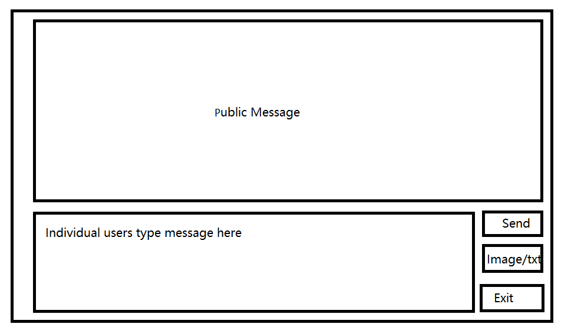

# Stage 1 Project Plan

## Stage 1 Learning Objectives

1. Basic use of Python
2. OOP
3. GUI
4. File read and write
5. Thread
6. Image processing
7. Web server and client

## Stage 1 Project 
1. Image filter editor GUI
2. Web-Based chat room

## Package Use
- PyQt5 / tkinter
- PIL
- threading
- socket

## Image Filter GUI

## Web-Based Chat Room
- Server (CMD)
  
  - Send text chat
  - Send image
  - Send plain text file

- Client (GUI)
  
    
    
